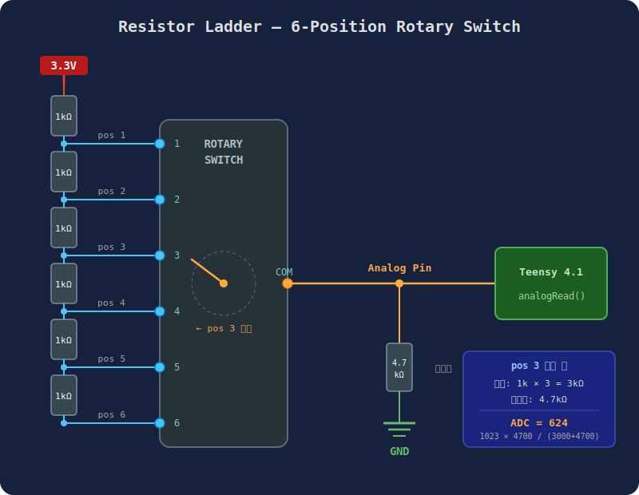
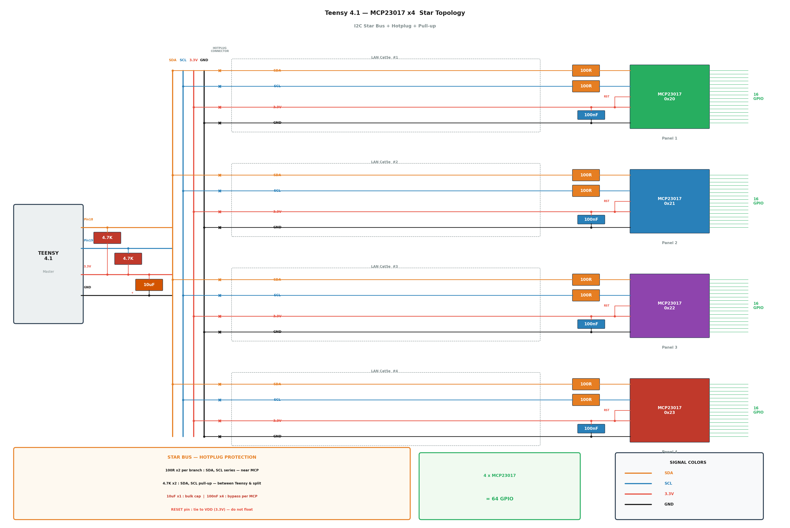
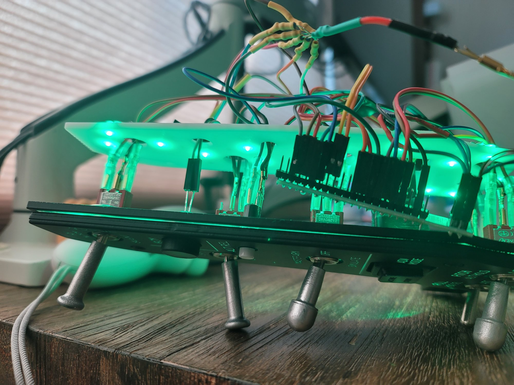
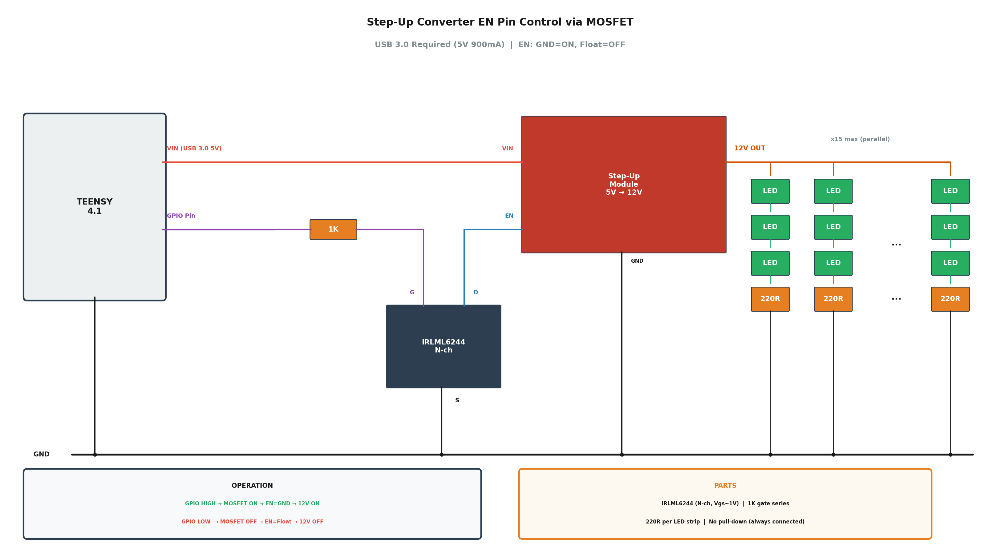

# REDKITE F16 PANELS


VR 전용 F-16 미니멀 데스크핏
**Falcon BMS**(BMS-BIOS)와 **DCS World**(DCS-BIOS) 자동 감지로 패널의 LED 연동

## Design Goals

VR 전용 미니멀 데스크핏을 지향합니다. VR 헤드셋을 쓰고 손을 뻗은 곳에 스위치가 있었으면 하는 생각을 1년 이상 참다가 결국 만들었습니다 ㅠㅠ 실기 1:1 스케일로 제작했습니다. 사용하지 않을 때 쉽게 치울 수 있는 이동식/수납식 구조를 대외적으로 표방(치울지는 모르겠음), 인게임 디스플레이로 충분한 계기류(DED, RWR, 엔진 게이지, HSI 등)는 제작하지 않고 스위치와 LED 위주로 구성했습니다.

## Features

- **Left Aux/MISC Panel 위주로 제작** — 사용 빈도가 높은 Gear, CMDS, TWA, Alt Gear로 구성된 Left Aux Panels과 MISC 패널 위주로 제작
- **이동식/수납식 구조** — Left/Right MFD Enclosure를 독립적으로 미니멀하게 제작하고 ICP 스탠드를 사이에 제작하여 안 쓸 때 MFD 쪽으로 내려 모니터 시야를 확보. 또한, PC 데스크톱 본체 위에 슬라이딩 마운트를 제작하여 Left Aux Console을 거치하고 안 쓸 때 테이블 밑으로 밀어 넣는 구조
- **MCP23017 I2C 확장** — I2C(MCP23017)를 이용하여 새로운 패널을 여러 개 추가 가능. MISC 패널은 MCP23017으로 제작하여 Left Aux Panels의 slave 장치로 동작
- **USB 3.0 백라이트** — 백라이트가 콕핏 패널의 백미. 별도 전원 없이 USB 3.0으로 공급 가능한 전력 범위 내에서 백라이트를 구현
- **USB Suspend 감지** — PC 절전 시 LED 소등 및 MCU 저전력 모드 진입으로 숙면 지원
- **프로토콜 자동 감지** — BMS-BIOS(바이너리) / DCS-BIOS(바이너리) 자동 판별해서 패널의 LED들을 연동

## Supported Panels and Input

| Panel | Type | Description |
|-------|------|-------------|
| Gear | Switch, LED | Landing Gear, Hook, Anti-skid, Landing Light, Gear Warning 등 |
| Alt Gear | Switch | ALT Gear Handle / Reset |
| MISC | Switch, LED (MCP23017) | Master ARM, Laser ARM, RF, Autopilot Pitch/Roll, ECM LED 등 |
| CMDS | Switch, Analog Ladder | RWR, JMR, MWS, JETT, MODE (6-pos), PRGM (5-pos) 등 |
| TWA | Analog Ladder, LED | Threat Warning Aux — Search, Act/Pwr, Low, Power |
| Pedal | Analog | Rudder + Left/Right Brake (auto calibration) |

## Hardware

### Panels

패널은 아래 콕핏 빌더 전문 업체에서 구매할 수 있습니다.

- [PC Flights](https://pcflights.com/flight-simulator-cockpit-panels/f-16c-viper-home-cockpit-panels/) — F-16C 패널 전문, 미국/해외 배송 **(본 프로젝트에서 사용한 패널)**

| MISC | Gear | CMDS |
|:----:|:----:|:----:|
| [](https://pcflights.com/f-16c-viper-miscellaneous-misc-panel-flight-sim-part/) | [](https://pcflights.com/f-16c-viper-landing-gear-panel-flight-simulator-module/) | [](https://pcflights.com/f-16c-viper-cmds-control-panel-module/) |

- [HispaPanel](https://hispapanels.com/tienda/en/20-f-16-fighting-falcon) — 레이저 커팅/각인 패널 키트, 커스텀 제작 가능
- [TEK Creations](https://tekcreations.space/shop/) — LED 백라이트 패널, DCS-BIOS 레디, [Etsy](https://www.etsy.com/shop/TekCreations)에서도 구매 가능

패널은 완제품을 구매하는 대신 3D 프린터로 직접 출력할 수 있습니다. 패널뿐 아니라 구조물(HUD frame 등)도 구할 수 있습니다. 저는 [Cults3D](https://cults3d.com)에서 구했습니다. 아래 참고하세요.

- [Greenisland](https://cults3d.com/en/users/Greenisland/3d-models) — F-16 콕핏 거의 전체 파트 판매
- [Legarsdusofa](https://cults3d.com/en/design-collections/Legarsdusofa/f-16-cockpit-simulator) — F-16 콕핏 거의 전체 파트 판매
- [The_Viper_Project](https://cults3d.com/en/users/The_Viper_Project/3d-models) — 버튼 노브, 스위치 캡, Dsub 캡 등 무료 제공

### Enclosures

`3d stl/` 폴더에 콕핏 패널 인클로저 및 스탠드의 3D 프린트용 STL 파일이 있습니다.
Enclosure는 강도와 가성비를 고려하여 PETG로 제작하였으며, JLC3DP에서는 PETG를 지원하지 않아 PCBWay에서 별도 주문하였습니다.
Stand는 각각 Left/Right Enclosure 뒷면에 부착하는 지지대입니다. 에폭시 접착제로 접합을 권장합니다.
Stand는 두 버전이 있으며, new 버전 사용을 권장합니다.

| Left Stand | Left Stand (new) | Right Stand | Right Stand (new) |
|:----:|:----:|:----:|:----:|
| <a href="3d%20stl/Left%20Stand.stl"></a> | <a href="3d%20stl/Left%20Stand%20-%20new.stl"></a> | <a href="3d%20stl/Right%20Stand.stl"></a> | <a href="3d%20stl/Right%20Stand-%20new.stl"></a> |

| Left Enclosure | Right Enclosure (new) | Enclosure OnePiece |
|:----:|:----:|:----:|
|  |  | <a href="3d%20stl/Enclosure%20-%20%20OnePiece2.stl"></a> |

> **Note:** Left Enclosure, Right Enclosure의 STL 파일은 Cults3D에서 구매한 모델을 수정하여 제작한 것이므로 저작권 보호를 위해 재배포하지 않습니다. 미리보기 이미지만 참고용으로 포함되어 있습니다.

### MCU

본 프로젝트는 [Teensy 4.1](https://www.pjrc.com/store/teensy41.html)을 사용합니다. 선택 이유:

- **이미 보유하고 있었음** — 가장 큰 이유
- **USB 조이스틱 128버튼 네이티브 지원** — Arduino Mega 등은 USB HID를 지원하지 않아 시리얼 통신 방식으로 제한됨
- **600MHz ARM Cortex-M7** — DCS-BIOS 프로토콜 파싱, LED 제어 등 다중 작업에 충분한 성능
- **VIN 핀을 통한 USB 5V 직접 출력** — 백라이트용 Step-Up 컨버터 전원 공급에 활용

### Components

주요 부품 (AliExpress 주문 기준, 전체 71건):

**스위치류**

| 부품 | 수량 | 비고 |
|------|------|------|
| 토글 스위치 On-Off-On (12mm, 3P) | 20 | |
| 토글 스위치 On-On (12mm, 3P) | 20 | |
| 푸시 스위치 7mm (PBS-110) | 12 | |
| 모멘터리 푸시 스위치 6mm (3핀) | 5 | |
| 택타일 스위치 SMD (6x6x4.3mm) | 20 | |
| 리밋 스위치 (12x6mm) | 10 | |
| 로터리 스위치 SR26 1P12T | 4 | |
| 로터리 스위치 RS16 1P6T / 1P5T | 2 / 2 | |
| 포텐셔미터 10kΩ | 10 | |
| 코리 스위치 | 1 | [HispaPanel](https://hispapanels.com/tienda/en/buttons-encoders/71-korry-type-tactile-switch-momentary.html) |
| 키보드 스위치 (Brown) | 2 | |

**IC / 반도체**

| 부품 | 수량 | 비고 |
|------|------|------|
| MCP23017 I2C I/O Expander | 4 | MISC 등 패널 확장용 |
| IRLML6244 N-ch MOSFET | 50 | Step-Up EN 핀 제어용 |

**LED**

| 부품 | 수량 | 비고 |
|------|------|------|
| 3mm LED Green (백라이트용) | 100 | 고휘도 |
| LED 키트 3mm/5mm Mixed | 300 | Red, Green, Yellow 등 |

**수동 소자**

| 부품 | 수량 | 비고 |
|------|------|------|
| 1/4W 저항 (1K, 4.7K, 10K, 100Ω, 150Ω, 220Ω) | 각 100 | 래더, 풀다운, 풀업 |
| SMD 1206 저항 (220Ω, 2.2K, 10K) | 각 100 | |
| 전해 커패시터 25V (10µF / 100µF) | 각 40 | 바이패스 |
| 세라믹 커패시터 (100nF / 1nF) | 각 100 | 바이패스 |

**커넥터 / 배선**

| 부품 | 수량 | 비고 |
|------|------|------|
| 실리콘 와이어 22AWG 5색 | 50m | |
| Dupont 커넥터 & 점퍼선 | 다수 | 쉘, 핀, F-F 점퍼 |
| Spade 압착 터미널 2.8mm | 200쌍 | 토글 스위치 연결 |
| Pin Header 1x30P | 10 | |
| 수축 튜브 | 750 | |

**모듈 / 기타**

| 부품 | 수량 | 비고 |
|------|------|------|
| Step-Up 컨버터 5V→12V (EN 핀 포함) | 2 | 백라이트 전원 |
| USB 2.0 패널 마운트 커넥터 | 1 | |
| RJ45 패널 마운트 커넥터 | 1 | I2C LAN 연결 |
| [GX076-30MB](https://www.alibaba.com/product-detail/7-6-Inch-Square-LCD-Display_1601257654342.html) 7.6" Square LCD | 2 | MFD용, Alibaba |
| 자석 15x3mm | 6 | |

상세 주문 내역은 [docs/AliExpress_Orders.xlsx](docs/AliExpress_Orders.xlsx) 참조.

### 소요 비용

| 유형 | 업체 | 내용 | 제품 (USD) | 배송 (USD) |
|------|------|------|----:|----:|
| 패널 | [PC Flights](https://pcflights.com) | MISC / Gear / CMDS 패널 3종 | $133.00 | $30.50 |
| 3D 프린트 (SLA/MJF) | [JLC3DP](https://jlc3dp.com) | 스위치 캡, 노브, LED 레이어, Alt Gear 등 소형 부품 | $63.63 | $20.00 |
| 3D 프린트 (PETG) | [PCBWay](https://www.pcbway.com) | Enclosure, Stand 등 대형 구조물 | $118.75 | ~$50 |
| MCU | [PJRC](https://www.pjrc.com) | Teensy 4.1 | ~$35 | - |
| 전자부품/배선재 | [AliExpress](https://www.aliexpress.com) | MCP23017, 스위치, LED, 저항, 커넥터, 배선재 등 | ~$200 | - |
| 노동력 | - | 약 1달간의 설계, 조립, 프로그래밍 | priceless | - |
| | | **합계** | **~$550** | **~$101** |

**있으면 좋은 것:**

| 유형 | 업체 | 내용 | 제품 | 배송 |
|------|------|------|----:|----:|
| MFD 패널 | [Thrustmaster](https://www.thrustmaster.com/products/mfd-cougar-pack/) | MFD Cougar Pack (2개) | ~$98 | - |
| ICP | [Simgears](https://www.simgears.com/products/f16-icp-se-usb-controller-standalone/) | F16 ICP SE USB Controller | €259 | 별도 |
| MISC 패널 | [TEK Creations](https://www.etsy.com/listing/1829038275/) | F16 MISC Panel Gen3 (백라이트, DCS-BIOS) | A$375 | - |
| Gear 패널 | [TEK Creations](https://tekcreations.space/product/f16-falcon-landing-controller/) | F16 Landing Gear Controller | A$375 | 별도 |
| LCD | [Alibaba](https://www.alibaba.com) | GX076-30MB 7.6" Square LCD (MFD용) x2 | $116 | - |

> 결론: 시간과 노동력을 고려하면 TEK Creations 등 완제품을 사는 게 현명합니다. 직접 만드는 건 취미입니다.

상세 주문 내역: [PCFlights_Orders.xlsx](docs/PCFlights_Orders.xlsx) / [JLC3DP_Orders.xlsx](docs/JLC3DP_Orders.xlsx) / [PCBWay_Orders.xlsx](docs/PCBWay_Orders.xlsx) / [AliExpress_Orders.xlsx](docs/AliExpress_Orders.xlsx)

## Build

### Arduino IDE Setup

1. [Teensyduino](https://www.pjrc.com/teensy/td_download.html) 설치
2. Arduino IDE에서:
   - **Board**: Teensy 4.1
   - **USB Type**: Serial + Keyboard + Mouse + Joystick (복합 디바이스, Windows 자동 인식)
3. 필요 라이브러리:
   - `Wire` (built-in)
   - `Keyboard` (built-in)

### 스위치류와 Teensy 핀 연결

상세 핀 배치는 [docs/teensy_direct_pins.txt](docs/teensy_direct_pins.txt) 참조.

### 저항 래더 (Resistor Ladder)

로터리 스위치(CMDS MODE 6-pos, CMDS PRGM 5-pos)와 TWA 패널 버튼(4개)은 각각 Teensy 아날로그 핀 1개에 저항 래더로 연결합니다. 핀 1개로 여러 버튼을 처리할 수 있어 핀 절약에 효과적입니다.

- 각 포지션마다 **1kΩ 직렬 저항**을 추가하여 고유한 ADC 값을 생성
- **4.7kΩ 풀다운 저항**으로 GND 기준 전압 분배
- ADC 값 = `1023 × 4700 / (k × 1000 + 4700)` (k = 선택된 포지션)
- 소프트웨어에서 tolerance(±25~30) 범위 내 매칭으로 인식
- 사용 핀: A10 (TWA 4버튼), A11 (CMDS MODE 6포지션), A12 (CMDS PRGM 5포지션)



> `ALLOW_DEBUG = true`로 시리얼 모니터에서 실제 analogRead 값을 확인하고 values[] 배열을 캘리브레이션하세요.

### MCP23017 패널 추가

Teensy의 다이렉트 핀은 모두 사용 중이므로, 추가 스위치/LED는 MCP23017 I2C 확장으로만 추가할 수 있습니다. MCP23017 하나당 16핀(GPA0–7, GPB0–7)을 제공하며, I2C 주소를 달리하여 최대 8개(0x20–0x27)까지 데이지체인 연결이 가능합니다. 랜선 8중 4핀으로 연결 가능. 기존 쉬프트레지스터 방식은 칩 별로 In/Out이 정해져 있지만 I2C는 칩의 모든 핀을 In/Out으로 설정 가능한 장점이 있음. 또한, 데이지체인 형태로 계속 slave 장치를 추가 가능하므로 teensy에 추가로 핀을 연결할 필요 없음. 향후 콜드앤다크스타트에서 사용하는 손맛을 위한 패널들 (예: ECM, Elec, Snsr, HUD 등) 대응도 마음만 먹으면 가능

```cpp
// MCP23017 패널 스위치 추가 예시 (mcpIdx: MCP 디바이스 번호, pin1: MCP 핀 번호)
{"New Switch",  PNL_MISC,  SW_ON_OFF,  0,  5,  0,  NULL},
//                                      ^   ^
//                               mcpIdx=0  GPA5
```

새 MCP 디바이스를 추가하려면 `mcpDevices[]` 배열에 I2C 주소를 등록하면 됩니다.

### I2C Star 토폴로지 & 핫플러그 보호

MCP23017 패널은 Teensy와 LAN(Cat5e RJ45) 케이블로 연결합니다. 각 패널은 독립 LAN 케이블로 Teensy에 직접 연결하는 **Star 토폴로지**를 사용합니다.

- **Star 연결**: 각 패널이 독립 케이블로 연결되므로, 한 패널의 분리/장애가 다른 패널에 영향을 주지 않음
- **핫플러그 보호**: LAN 커넥터 착탈 시 핀 접촉 순서가 불규칙하므로 보호 회로 필요
  - SDA/SCL 각 100Ω 직렬 저항 (MCP 입력단) — 돌입전류 제한
  - 4.7kΩ × 2 I2C 풀업 저항 — Teensy와 분기점 사이에 배치
  - 10µF + 100nF 바이패스 캡 — MCP23017 VDD 전압 스파이크 흡수
  - RESET 핀 → VDD(3.3V) 직결 — 플로팅 방지
- **I2C 주소**: A0~A2 핀으로 설정, 최대 8개 (0x20~0x27) ([주소 설정표](docs/mcp23017_address.md))
- **상세 사양**: [핫플러그 사양](docs/hotplug_spec.md) / [MISC 패널 사양](docs/misc_panel_spec.md)



### 백라이트

백라이트는 콕핏 패널의 백미이므로 생략할 수 없지만, 별도 전원 없이 USB 3.0으로 감당 가능한 수준으로 간략하게 구성합니다.

- **전원**: Teensy 4.1의 Vin 핀에서 Step-Up 컨버터로 12V boost. Vin은 USB 5V가 온보드 레귤레이터를 거치지 않고 직접 나오는 핀이므로, USB 3.0의 전력 예산(900mA)을 최대한 활용할 수 있다. 3.3V 핀은 온보드 레귤레이터를 거쳐 공급 전류가 제한(~250mA)되므로 백라이트 전원으로 부적합
- **ON/OFF 제어**: Teensy GPIO → MOSFET(IRLML6244) → Step-Up EN 핀 제어 ([상세 설명](docs/stepup_en_control.md))
- **인게임 연동**: 온라인(BMS/DCS 연결) 시 인게임 INST PNL 조명 노브에 연동되어 자동 ON/OFF. BMS는 FlightData2 `instrLight`, DCS는 `LIGHT_INST_PNL`(0x4484) 값 사용. 현재 EN 핀 제어 방식으로 단순 ON/OFF만 지원하며, PWM 디밍은 별도 MOSFET 회로 추가 필요
- **오프라인 수동 제어**: 시뮬레이터 미연결(오프라인) 시 DN LOCK REL을 누른 채 Landing Light 스위치로 백라이트를 수동 제어 가능. OFF 위치=백라이트 끔, TAXI/LANDING 위치=백라이트 켬. 브릿지 연결 시 자동 복구
- **LED**: 3V / 20mA 녹색 고휘도 3mm LED
- **회로 구성**: LED 3개 + 220Ω 저항 1개로 구성된 직렬 스트링을 최대 15개까지 병렬로 분산 배치 (20mA × 15 = 300mA @ 12V)
- **패널 구조**: PC Flights 패널은 2중 구조. 전면은 흰색 판넬에 검정 도색 + 글자 흰색 각인, 후면은 투명 패널
- **배치 방법**: 후면 투명 패널 뒤쪽에서 LED를 쏴주면 전면 각인 글자가 빛남. 전력 제한으로 LED 45개 이내로 사용해야 하므로, 후면 패널에 밀착시키지 않고 1~2cm 간격을 두어 빛이 넓게 퍼지도록 배치
- **패널별 배치**: MISC 15개(5스트립) / Gear 18개(6스트립) / CMDS 12개(4스트립), 총 45개(15스트립)


- **전력 계산**: Teensy 4.1(~100mA) + MCP23017(~1mA) + 백라이트(300mA @ 12V) 감안하여 USB 3.0 전력 예산(900mA @ 5V) 내에서 운용

> **왜 MOSFET이 필요한가?** Step-Up EN 핀은 5V 도메인에서 동작하는데, Teensy GPIO는 3.3V라서 HIGH(3.3V)가 5V HIGH로 인식되지 않아 컨버터가 꺼지지 않는 문제가 있고, EN 내부 5V 풀업으로 인해 5V tolerant 하지 않은 Teensy GPIO가 손상될 위험이 있다. N-ch MOSFET으로 EN-GND 사이를 스위칭하면 두 문제를 모두 해결할 수 있다.

> **Note:** EN 핀 특성(GND=ON, Float=OFF)은 Aliexpress에서 구매한 Step-Up 모듈 기준이며, 다른 제조사/모듈은 EN 핀 동작이 다를 수 있습니다. 사용 전 데이터시트를 반드시 확인하세요.



> COB LED 스트링도 검토했으나, 모든 패널에 두르려면 소모 전력이 높아 별도 전원 공급 없이는 운용이 어려워 포기했습니다.

## 스위치 Customization

스위치/LED 등 하드웨어 변경 시 `REDKITE_F16_LEFT_AUX_MISC.ino`의 **HARDWARE CONFIGURATION** 섹션의 config 배열만 수정하면 됩니다. 패널을 비활성화하려면 해당 항목을 주석 처리하면 됩니다.

```cpp
// 스위치 추가 예시
const SwitchDef switches[] = {
  // name         panel        type         mcpIdx  pin1  pin2  stateRef
  {"My Switch",   PNL_GEAR,    SW_ON_OFF,      -1,    5,    0,  NULL},
};

// 아날로그 버튼 배열 추가 예시
const AnalogBtnArrayDef analogBtnArrays[] = {
  // groupName    panel      pin  numBtn  btnNames       values         tolerance
  {"My Buttons",  PNL_CMDS,  A11, 4,      myBtnNames,    myBtnValues,   20},
};
```

### Extreme 조이스틱 설정

Windows의 기본 Joystick은 32버튼까지만 지원하지만, Teensyduino의 Extreme Joystick 모드는 128버튼을 지원합니다. 현재 49버튼을 사용하며 I2C 패널 확장 시 더 늘어나므로 이 모드가 필요합니다. Teensy 빌드 전 `%LOCALAPPDATA%\Arduino15\packages\teensy\hardware\avr\<version>\cores\teensy4\usb_desc.h`에서 `JOYSTICK_SIZE`를 `64`로 변경:

```c
#define JOYSTICK_SIZE         64    //  12 = normal, 64 = extreme joystick
```

조이스틱 버튼은 런타임에 순차 번호가 자동 부여되지만, 인게임 내의 키 매핑은 직접 해주셔야 합니다. 페달은 러더 + 독립 브레이크를 합성하며 자동 캘리브레이션을 지원합니다. 현재 배치는 [docs/joystick.txt](docs/joystick.txt) 참조.

### Upload

Arduino IDE에서 `REDKITE_F16_LEFT_AUX_MISC.ino`를 열고 Upload.

## DCS-BIOS / BMS-BIOS Protocol Support

스위치/버튼 입력은 USB Joystick으로 직접 전달되지만, LED 상태는 시뮬레이터에서 받아와야 합니다. Python 브릿지가 시뮬레이터의 내부 데이터를 읽어 시리얼로 Teensy에 전송하고, Teensy는 수신된 프로토콜(BMS-BIOS / DCS-BIOS)을 자동 감지하여 LED를 제어합니다. 시뮬레이터 전환 시 6초 타임아웃 후 자동 재감지. 오프라인(시뮬레이터 미연결) 시에는 Landing Gear 스위치 상태에 따라 Gear LED 3개를 시뮬레이션하고(2초 딜레이), 기어 상태 변경 시 Gear Warn LED를 5초간 점등합니다.

### Falcon BMS (BMS-BIOS)

- 바이너리 프로토콜, `0xAA 0xBB` sync 2바이트로 자동 감지
- Python 브릿지(`tools/bmsbios_bridge.py`)가 BMS 공유 메모리에서 LED 상태를 읽어 Teensy로 전송
- BMS 실행 전에 bridge를 먼저 실행해도 안전 (공유 메모리 생성하지 않음)
- 사용법:
  ```
  pip install pyserial
  python ../tools/bmsbios_bridge.py                    # COM port auto-detect
  python ../tools/bmsbios_bridge.py COM4:AUX --debug   # manual
  ```

> **참고 — Why not F4ToSerial?** 이전 버전에서는 [F4ToSerial](https://github.com/Music-Junky/F4ToSerial)을 사용했으나, F4TS는 Teensy의 다이렉트 핀만 지정 가능하고 MCP23017 등 I2C 확장 핀을 지원하지 않는 문제가 있어 BMS-BIOS로 대체했습니다. 부수적으로 JSON 파싱 오버헤드 제거, ArduinoJson 의존성 제거 등 소소한 이점도 기대할 수 있습니다 (체감 차이는 미지수). DCS-BIOS/BMS-BIOS 프로토콜을 직접 구현했으므로 향후 DCS나 BMS 업데이트로 주소/오프셋이 변경되면 직접 수정이 필요하지만, 소스가 명확하고(`docs/protocol_reference.txt` 참조) 수정 범위도 작아 큰 부담은 아닙니다. 게다가 [Claude Code](https://claude.com/claude-code)도 있으니 든든합니다.

### DCS World (DCS-BIOS)

- 바이너리 프로토콜, `0x55` sync 4바이트로 자동 감지
- DCS-BIOS 설치 및 UDP 브릿지(`tools/dcsbios_bridge.py`) 필요
- 사용법:
  ```
  pip install pyserial
  python ../tools/dcsbios_bridge.py             # COM port auto-detect
  ```

## Project Structure

```
REDKITE-F16-Panels/
├── REDKITE_F16_LEFT_AUX_MISC/  # Teensy 4.1 — Left Aux + MISC 패널
│   ├── REDKITE_F16_LEFT_AUX_MISC.ino
│   ├── BiosHandler/
│   ├── name.c
│   └── backup/
├── REDKITE_F16_LEFT_CONSOLE/   # Teensy 4.0 — ECM + ELEC 패널
│   ├── REDKITE_F16_LEFT_CONSOLE.ino
│   ├── BiosHandler/
│   └── name.c
├── tools/                       # Python 브릿지 (BMS/DCS → Teensy)
│   ├── bmsbios_bridge.py
│   ├── dcsbios_bridge.py
│   └── update_joystick_name.bat
├── docs/                       # 배선도, 사양서, 프로토콜 참조
├── 3d stl/                     # 3D 프린트용 STL 파일
└── CLAUDE.md                   # Claude Code 가이드
```

## License

This project is licensed under the [MIT License](LICENSE).
